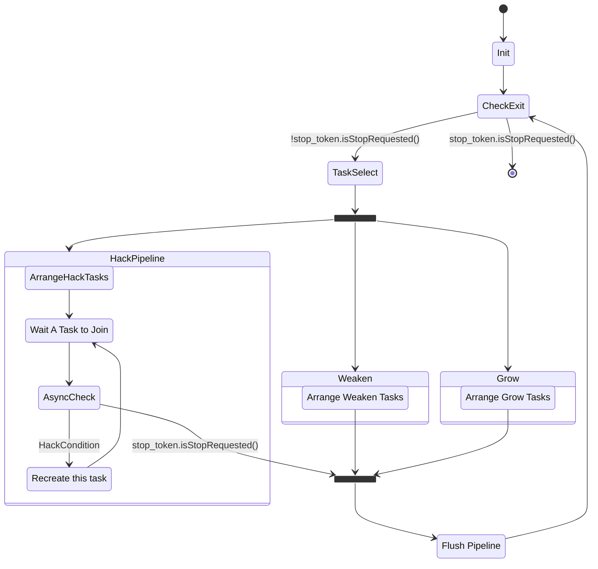

# Pipeline Batching

```mermaid
stateDiagram-v2
    [*] --> Init
    Init --> CheckExit
    CheckExit --> TaskSelect: !stop_token.isStopRequested()
    CheckExit --> [*]: stop_token.isStopRequested()
    state TaskSelect_fork <<fork>>
    TaskSelect --> TaskSelect_fork
    TaskSelect_fork --> Weaken
    TaskSelect_fork --> HackPipeline
    TaskSelect_fork --> Grow
    state FlushPipeline_join <<join>>
    FlushPipeline: Flush Pipeline
    FlushPipeline_join --> FlushPipeline
    FlushPipeline --> CheckExit
    
    state Weaken{
        ArrangeWeakenTasks: Arrange Weaken Tasks
    }
    ArrangeWeakenTasks --> FlushPipeline_join
    state Grow{
        ArrangeGrowTasks: Arrange Grow Tasks
    }
    ArrangeGrowTasks --> FlushPipeline_join
    
    state HackPipeline{
        ArrangeHackTasks --> WaitAJoinTask
        WaitAJoinTask: Wait A Task to Join
        WaitAJoinTask --> AsyncCheck
        AsyncCheck --> RecreateThisTask: HackCondition
        RecreateThisTask: Recreate this task
        RecreateThisTask --> WaitAJoinTask
    }
    AsyncCheck --> FlushPipeline_join: stop_token.isStopRequested()
```